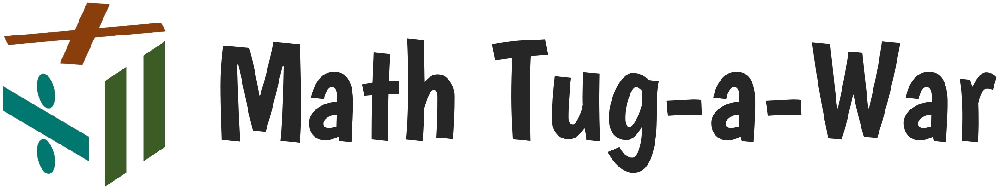

<h2 align="center">
  A quick-action mental-math game for students and hobbyists
</h2>
<div align="center">

[](https://github.com/mcdanieles/math-tug-a-war/actions/workflows/build-angular-application.yml)    [](https://github.com/mcdanieles/math-tug-a-war/actions/workflows/build_and_deploy_backend_api.yml)    [](https://github.com/mcdanieles/math-tug-a-war/tags)    [](https://github.com/mcdanieles/math-tug-a-war/releases)

</div>

## Purpose
This is a full-stack web application designed, architected, developed, tested, documented, and deployed as a Fall '23 semester-long group project for the University of Illinois - Springfield's CSC 478 Software Engineering Capstone.


---
##  Getting Started

There is a *ton* more to fill out here, but I'm just laying out the groundwork. The general project structure is:

```
           /‾‾‾ /backend-api => Contains the Java Spring Boot API layer
(root) --> ⎸
           \___ /frontend-ui => Contains the Angular frontend UI layer
```